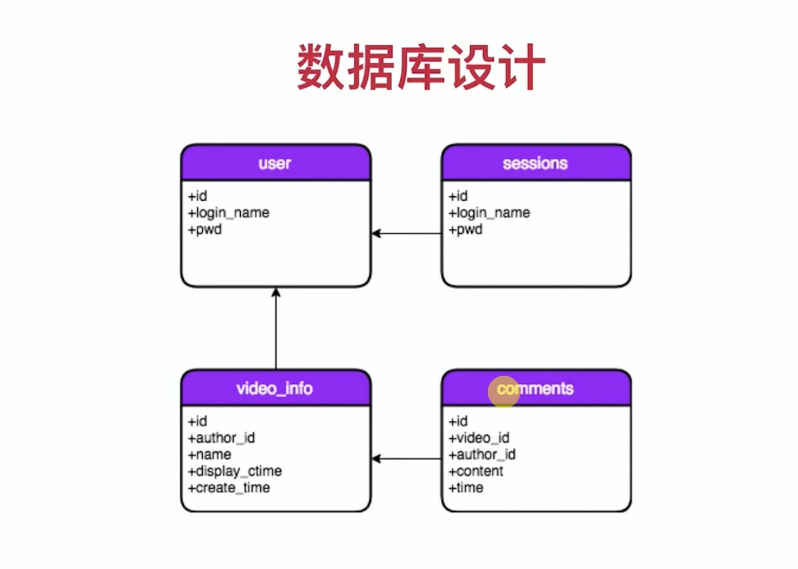

# TABLES

## users
id unsigned int,primary key,auto_increment //用户看不到
login_name varchar(64),unique key //不能重名
pwd text

## video_info
id varchar(64),primary key,not null //存uuid
author_id  unsigned int //equal to user's id
name text
display_ctime text
create_time datetime
## comments
id varchar(64),primary key, not null
video_id varchar(64)
author_id unsigned int
content text
time datetime

## sessions
session_id tinytext,primary key, not null
TTL tinytext
login_name varchar(64)
