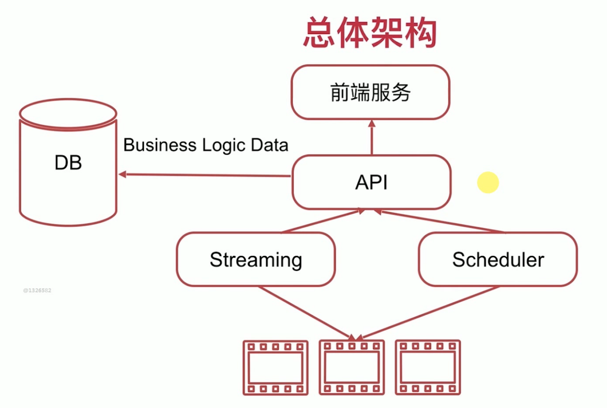

# 总体架构

// handler -validation{1.request,2.user}->bussiness logic->response
//1. data model
//2.error handle
# API设计：用户
* 创建（注册）用户：URL:/user Method:POST,StatusCode:201(created),400(bad request),500
* 用户登录：URL:/user/:username Method:POST,SC:200(OK),400(Bad Request),500
* 获取用户基本信息: URL:/user/:username Method:GET,SC:200,400,401(未验证 unauthorize),403(验证但是未通过 foridden),500
* 用户注销： URL: /user:username Method:Delete,SC:204,400,401,403,500

# 用户资源
* List all videos: URL:/user/:username/videos Method:GET,SC,200,400,500 
* Get one video:URL:/user:username/videos/:vid-id Method :GET,SC:200,400,500
* delete one video::URL:/user:username/videos/:vid-id Method :DELETE,SC:200,204,400,401,403,500

# 评论
* show comments :URL:/videos/:vid-id/comments Method:POST,SC:201,400,500
* Post a comment :URL:/videos/:vid-id/comments Method:POST,SC:201,400,500
* delete a comment :URL:/videos/:vid-id/comment/:comment-id Method:DELETE,SC:204,400,401,403,500

